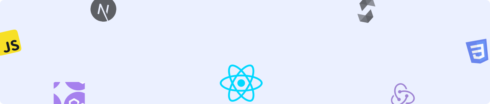

# AA Markdown Library

**Welcome to the AA Markdown Library!**  
This repository is a curated collection of **Markdown-based resources, cheatsheets, and real-world experience-driven guides**. Whether you're a developer or tech enthusiast, you'll find structured, high-quality materials to enhance your workflow.  

### 🚀 What You’ll Find:  
- **Comprehensive Cheatsheets** – Quick references for Markdown syntax and advanced usage.  
- **Best Practices & Guides** – Practical insights from real-world experience.  
- **Resourceful Knowledge Base** – Curated materials to boost productivity and learning.  

---

## 🔍 Table of Contents
1. [Docker](#1-docker)

---

## 1. Docker
Docker is a platform that enables developers to build, ship, and run applications in isolated environments called containers. It simplifies deployment, improves scalability, and ensures consistency across different systems.

📂 What You’ll Find Here:  
✅ Cheatsheets – Quick Docker commands for daily use  
✅ Guides from Real Experience – Practical insights, best practices, and troubleshooting tips

🚀 Master containerization with hands-on knowledge and real-world use cases!

### Reference
- [Docker Official Website](https://www.docker.com/)

### 📝 Cheatsheets
- [Docker Cheatsheet](./resources/docker/Docker_Cheatsheet.md)